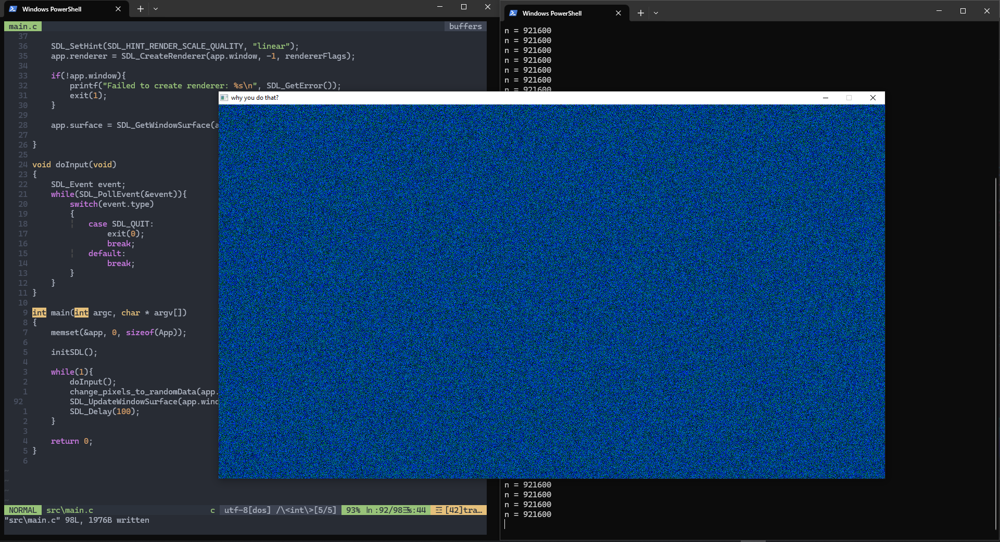

# SDL-c-projects
My objective is get better on C doing different projects.

## General project's structure

```bash
C:.
│   main.exe
│   Makefile
│   SDL2.dll
│
├───include
│   └───SDL2
│
├───lib
│   │
│   ├───cmake
│   │   └───SDL2
│   │
│   └───pkgconfig
│
└───src
        main.c

```

* The `Makefile` allows easy compilation of the project files!

## Project 001 - A simple Tv distortion 
This project demonstrates how to manipulate pixels on the screen using the surface pointer in SDL.
### New Concepts learned or reforced
* Proper usage of pointers (`*`).
* Using the [SDL2](https://wiki.libsdl.org/SDL2/SDL_CreateWindow) API.
### Results


## References and interesting links
* Other tutorials i plan check: https://www.parallelrealities.co.uk/tutorials/
* https://wiki.libsdl.org/SDL2/Tutorials
* Inspiration: https://www.youtube.com/@HirschDaniel